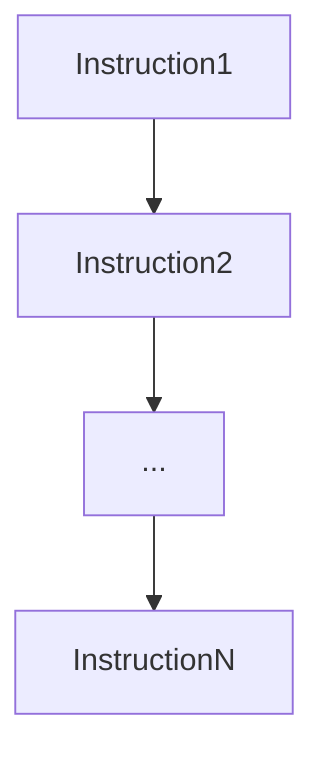

# Why there was a need for a new docker builder

## Build a React APP using builder pattern

Create the app using `npx` command as shown [here](https://reactjs.org/docs/create-a-new-react-app.html#create-react-app)
```
npx create-react-app allhands-app
```
Now to dockerize this app using builder pattern we will write 2 Dockerfiles.

[Dockerfile.0] - Builds the source code for the app

[Dockerfile.1] - Contains the final app to run

```
# Build the source code
docker build -t sujaypillai/ahapp:0 -f Dockerfile.0 .

# Create a container so that we can copy out the build artifacts
docker create --name build sujaypillai/ahapp:0

# Copy out the artifacts from the container to a folder named app
docker cp build:/app/build ./app

# Build the new image witIh build artifcats using nginx image
docker build --no-cache -t sujaypillai/ahapp:1 -f Dockerfile.1 .

# Run the app
docker run -p 3000:3000 sujaypillai/ahapp:1

# Use the multi-stage build to overcome builder pattern problem
docker build -t sujaypillai/ahapp:2 -f Dockerfile.2 .
```



* Sequential execution of instructions 
* Multi-stage builds introduced in Docker 17.06 CE solved builder pattern problem.
* Long build time, no reuse of build/sharing cache

# BUILDKIT

* Docker 18.06 introduced BUILDKIT which was opt-in feature
* New standalone project built from the learning and failuers of old builder
    - Concurrent
    - Cache-efficient
    - Better storage management
* [Design Proposal](https://github.com/moby/moby/issues/32925)

### Features

 - Automatic garbage collection

 - Extendable Frontend formats

 - Concurrent dependency resolution

 - Efficient instruction caching

 - Build cache import/export

 - Nested build job invocations

 - Distributable workers

 - Multiple output formats

 - Pluggable architecture

 - Execution without root privileges

### Enabling BUILDKIT

**Latest Docker Desktop by default has BUILDKIT enabled**

### Configure in /etc/docker/daemon.json
```
{ "features": { "buildkit": true } }
```

```
export DOCKER_BUILDKIT=1 

export COMPOSE_DOCKER_CLI_BUILD=1

# This will fail with old builder as it has new instruction sets only supported in BUILDKIT
DOCKER_BUILDKIT=0 docker build -t sujaypillai/ahapp:2 -f Dockerfile .

# Enabling BUILDKIT on cli
DOCKER_BUILDKIT=1 docker build -t sujaypillai/ahapp:2 -f Dockerfile .
```

```bash
buildctl build \
    --frontend=dockerfile.v0 \
    --local context=. \
    --local dockerfile=.
```
### Limitations
* Only support for linux containers 
* Active development being done in [Windows containers](https://github.com/moby/buildkit/issues/616) to support buildkit 

> BuildKit is composed of the `buildkitd` daemon and the `buildctl` client.
While the `buildctl` client is available for Linux, macOS, and Windows, the `buildkitd` daemon is only available for Linux currently.


## Used by
BuildKit is used by the following projects:

-   [Moby & Docker](https://github.com/moby/moby/pull/37151) (`DOCKER_BUILDKIT=1 docker build`)
-   [img](https://github.com/genuinetools/img)
-   [OpenFaaS Cloud](https://github.com/openfaas/openfaas-cloud)
-   [container build interface](https://github.com/containerbuilding/cbi)
-   [Tekton Pipelines](https://github.com/tektoncd/catalog) (formerly [Knative Build Templates](https://github.com/knative/build-templates))
-   [the Sanic build tool](https://github.com/distributed-containers-inc/sanic)
-   [vab](https://github.com/stellarproject/vab)
-   [Rio](https://github.com/rancher/rio)
-   [kim](https://github.com/rancher/kim)
-   [PouchContainer](https://github.com/alibaba/pouch)
-   [Docker buildx](https://github.com/docker/buildx)
-   [Okteto Cloud](https://okteto.com/)
-   [Earthly earthfiles](https://github.com/vladaionescu/earthly)
